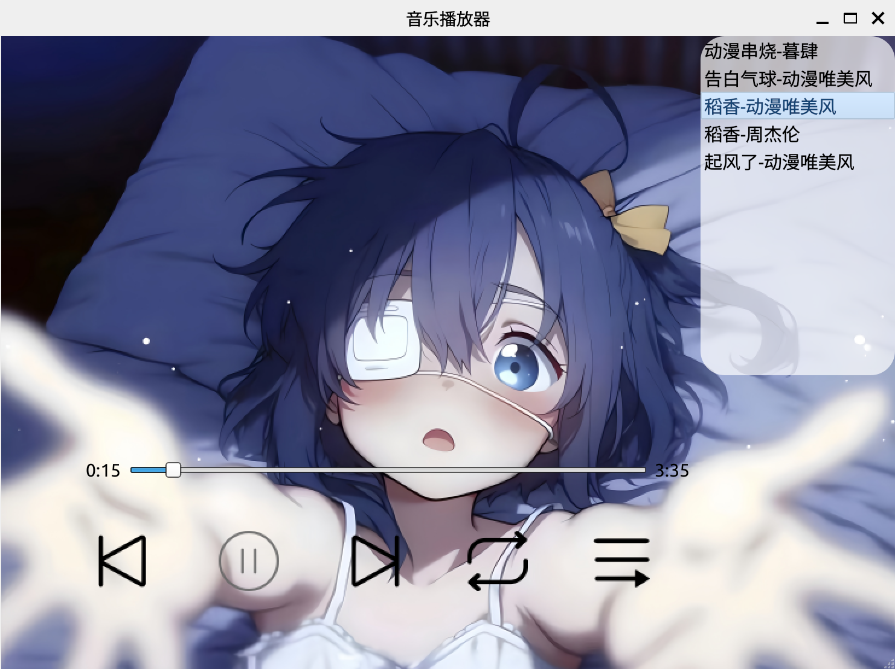

## 基于qt5的轻量化音频播放器

## 目录

[背景](#背景)  
[效果展示](#效果展示)  
[使用指南](#使用指南)  
[开发日志](#开发日志)  
[环境配置](#环境配置)  
[参考资源及工具](#参考及工具)  
[其他(我的记录)](#其他)  

### 背景

基于c++的一款音频开发项目。

个人层面，为了提高ability of coding，同时熟悉一下加入图像化的软件开发；实用性方面，希望可以为Ubuntu的用户开发一款可以随时部署的听歌软件.喜欢的话给作者一个star!👋

个人开发设备型号

```shell
lsb_release -a                                                       
No LSB modules are available.
Distributor ID:	Ubuntu
Description:	Ubuntu 22.04.5 LTS
Release:	22.04
Codename:	jammy
```

### 效果展示

#### 图片效果




#### 实机演示


### 开发日志

- 2025-6.11 
  - 资源文件添加完成.
  - 完成按钮图标的初始化，按钮添加悬停与点击效果.
  - 完成背景的设置.
  - 完成音乐媒体器的环境配置，支持点击播放音乐，但是每次暂停后要从头开始播放.

- 2025-6.12
  - 添加上下切换的按钮的逻辑.
  - 实现不同播放模式的变化逻辑.
  - 添加music_list的UI的变化显示逻辑.
  - 关闭了音乐播放功能，用于调试.

- 2025-6.13
  - 修复音乐播放功能.
  - 添加音乐列表的渐进式动画.
  - 添加音乐播放进度条.
  - 添加通过音乐列表切换歌曲功能.
  - 优化音乐列表的UI，美化悬停与点击效果.

### 环境配置

- 安装qt5-multimedia库
  ```shell
  sudo apt-get install qtmultimedia5-dev
  ```

- 安装核心 GStreamer 插件和 Qt 多媒体支持
  ```shell
  sudo apt install gstreamer1.0-plugins-base \
                 gstreamer1.0-plugins-good \
                 gstreamer1.0-plugins-bad \
                 gstreamer1.0-plugins-ugly \
                 gstreamer1.0-libav \
                 libgstreamer-plugins-base1.0-dev \
                 qtmultimedia5-dev \
                 libqt5multimedia5-plugins
  ```
  测试是否可以播放
  ```shell
  gst-launch-1.0 playbin uri=file:///home/cjj/Music/起风了-动漫唯美风.ogg
  ```

- 安装bear
  ```shell
  sudo apt-get install bear
  ```

### 使用指南

- 配置环境，见[环境配置](#环境配置)

- 下载原项目
  ```shell
  git clone https://github.com/cuijunjie18/Music_player.git
  cd Music_player
  ```

- 修改音乐播放路径
  
  修改src/window_cjj下的源码
  ```cpp
  // 修改MainWindow的构造函数
  QString music_dir = "/home/cjj/Music";
  ```
  这里设置为自己的存放音乐的文件夹路径
- 编译文件
  ```shell
  cd Music_player
  bash build.sh
  # 或者 zsh build.sh
  ```

- 启动
  ```shell
  ./bin/main
  ```

### 其他

- .mp3转.wav
  ```shell
  ffmpeg -i <origin.mp3> <origin.wav>
  ```

- 信号绑定槽函数要确保所有的变量、函数都存在  
  错误例子
  ```cpp
  connect(music_player,&QMediaPlayer::positionChanged,this,&MainWindow::HandleMusicPosition); // 处理音乐进度
  music_player = new QMediaPlayer(this)
  ```

  正确做法
  ```cpp
  music_player = new QMediaPlayer(this)
  connect(music_player,&QMediaPlayer::positionChanged,this,&MainWindow::HandleMusicPosition); // 处理音乐进度
  ```

- connect的信号函数要与槽函数的参数匹配


### 参考及工具

- bear： https://github.com/rizsotto/Bear
- qt官网： doc.qt.io
- 阿里矢量图库： www.iconfont.cn
- gif转换： www.freeconvert.com/zh/convert/video-to-gif
